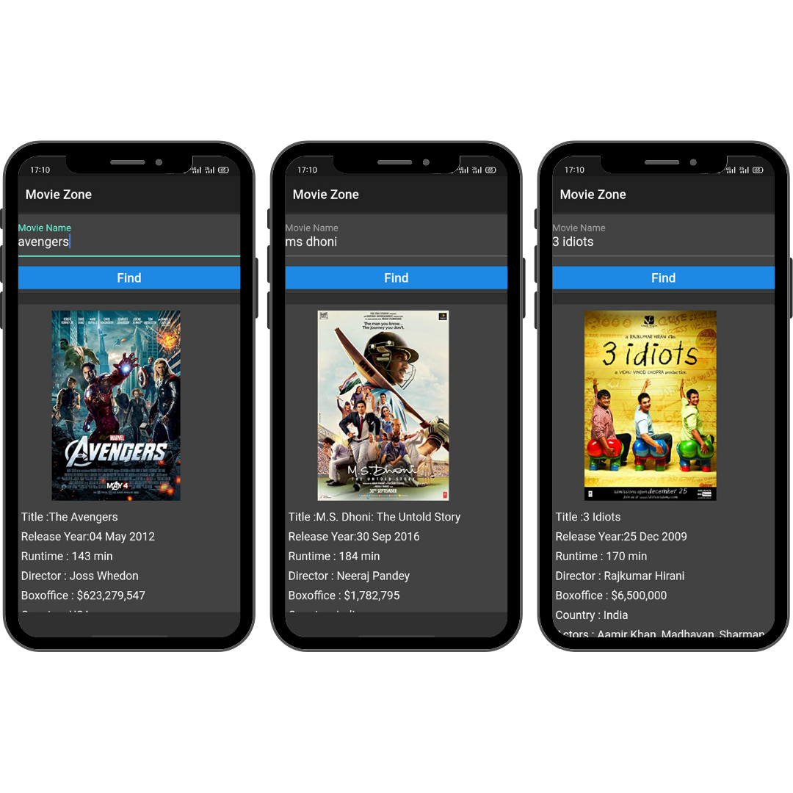

# Movie Zone

Flutter Application to get movie details

## Features
* [x] Poster of Movie 
* [x] Released Date
* [x] Country
* [x] IMDB Rating
* [x] Runtime
* [x] Director

## Screenshots
 

## API used
* http://omdbapi.com/

## Contributing 💡
If you want to contribute to this project and make it better with new ideas, your pull request is very welcomed.
If you find any issue just put it in the repository issue section, thank you.

## Contact me
Email: viralvaghela7109@gmail.com 

LinkedIn: [viralvaghela](https://linkedin.com/in/viralv)  

Twitter: [@MrCodingBoy](https://twitter.com/MrCodingBoy)

[Follow me on Instagram for daily awesome coding posts](https://instagram.com/coding_boy_)

